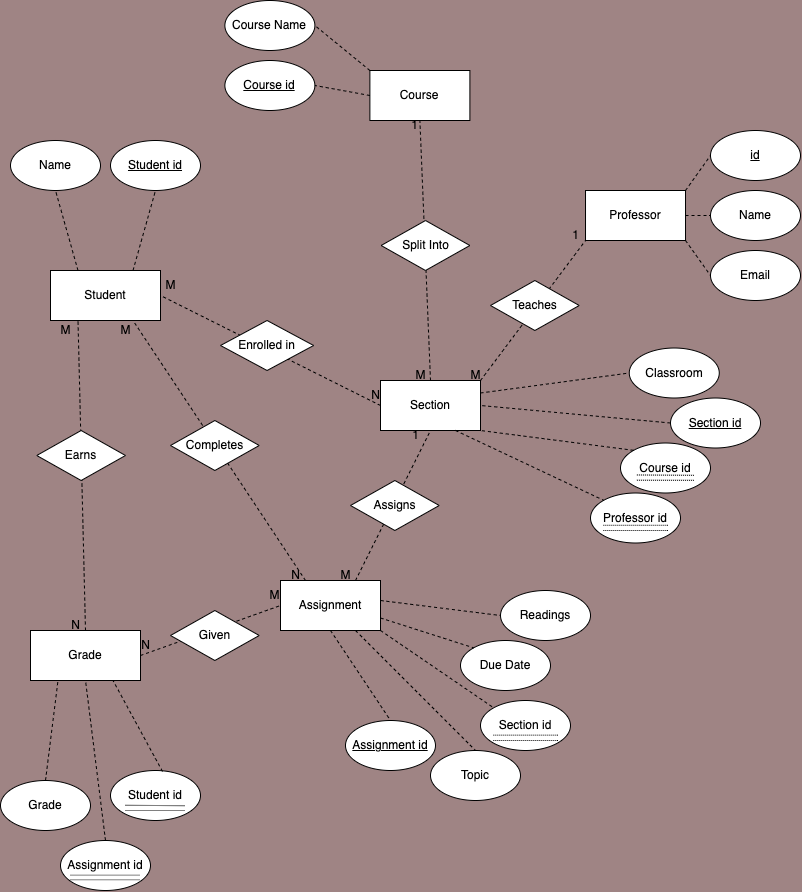

# Data Normalization and Entity-Relationship Diagramming

## Table Containing Original Data Set

| assignment_id | student_id | due_date | professor | assignment_topic                | classroom | grade | relevant_reading    | professor_email   |
| :------------ | :--------- | :------- | :-------- | :------------------------------ | :-------- | :---- | :------------------ | :---------------- |
| 1             | 1          | 23.02.21 | Melvin    | Data normalization              | WWH 101   | 80    | Deumlich Chapter 3  | l.melvin@foo.edu  |
| 2             | 7          | 18.11.21 | Logston   | Single table queries            | 60FA 314  | 25    | Dümmlers Chapter 11 | e.logston@foo.edu |
| 1             | 4          | 23.02.21 | Melvin    | Data normalization              | WWH 101   | 75    | Deumlich Chapter 3  | l.melvin@foo.edu  |
| 5             | 2          | 05.05.21 | Logston   | Python and pandas               | 60FA 314  | 92    | Dümmlers Chapter 14 | e.logston@foo.edu |
| 4             | 2          | 04.07.21 | Nevarez   | Spreadsheet aggregate functions | WWH 201   | 65    | Zehnder Page 87     | i.nevarez@foo.edu |
| ...           | ...        | ...      | ...       | ...                             | ...       | ...   | ...                 | ...               |

## Why Data Set Is Not Compliant With 4NF

For a record to meet fourth normal form, it has to satisfy the requirements of third normal form and must not contain more than one independent multi-valued fact about an entity. Because the data set does not meet these requirements, it is not compliant with forth normal form. 

**1NF:** The original data set is compliant with 1NF.

**2NF:** It is essential that non-key fields provide a fact about the entity that the primary key uniquely identifies. The data set must also be compliant with 1NF. If the original data set uses assignment_id and student_id as a composite primary key, it does not meet 2NF, because the non-key fields do not each provide information about the assignment_id/student_id combined entity. For example, the relevant_reading, due_date, professor, classroom, and assignment_topic fields are not facts about both assignment_id and student_id together, most fields only providing facts about assignment_id. 

**3NF:** 3NF is violated when 2NF is not met or when a non-key field provides a fact about another non-key field. The original data set is not compliant with 3NF because the field, professor_email, provides a fact about the field, professor, which is not a primary key.

**4NF:** 4NF is violated when 3NF has not been met or when the data set contains more than one independent multi-valued fact about the entity. The original data set already fails to meet 2NF and 3NF, so 4NF has already been violated. 

## Tables Containing 4NF-Compliant Version

#### Courses
| course_id | course_name |
| :-------- | :--------- |
| 1         | Database Design |
| 2         | Web Programming |
| 3         | English 101 |
| 4         | CS 101 |
| 5         | Art History |
| ...   | ...   |

#### Professors
| professor_id | professor_name | professor_email |
| :-------- | :--------- | :--------- |
| 1         | Melvin | l.melvin@foo.edu  |
| 2         | Logston | e.logston@foo.edu |
| 3         | Nevarez | i.nevarez@foo.edu |
| 4         | Peddle | cep454@nyu.edu |
| 5         | Bloomberg | bloomberg@nyu.edu |
| ...   | ...   | ...   |

#### Sections
| section_id | classroom | course_id | professor_id |
| :-------- | :--------- | :--------- | :--------- |
| 1         | WWH 101  | 1 | 1  |
| 2         | 60FA 314 | 1 | 2  |
| 3         | WWH 201 | 2 | 3  |
| 4         | 60FA 314 | 4 | 3  |
| 5         | WWH 201 | 1 | 1  |
| ...   | ...   | ...   | ...   |

#### Students
| student_id | student_name | 
| :-------- | :--------- | 
| 1         | Stella Grey | 
| 2         | Joe Jones | 
| 3         | Natalie Mena | 
| 4         | Stephanie Christos | 
| 5         | Mariam Khalidi |
| ...   | ...   | 

#### Students/Sections
| student_id | section_id | 
| :-------- | :--------- | 
| 1         | 1 | 
| 2         | 3 | 
| 2         | 2 | 
| 3         | 7 | 
| 4         | 1 |
| ...   | ...   | 

#### Assignments 
| assignment_id | assignment_topic | due_date | relevant_reading | section_id |
| :-------- | :--------- | :--------- | :--------- | :--------- |
| 1         | Data normalization  | 23.02.21 | Deumlich Chapter 3  | 1 |
| 2         | Single table queries  | 18.11.21 | Dümmlers Chapter 11  | 2 |
| 3         | Intro to python | 04.01.21 | Deumlich Chapter 1  | 5 |
| 4         | Spreadsheet aggregate functions | 04.07.21 | Zehnder Page 87  | 3 |
| 5         | Python and pandas  | 05.05.21 | Dümmlers Chapter 14  | 2 |
| ...   | ...   | ...   | ...   | ...   |

#### Grades 
| student_id | assignment_id | grade |
| :-------- | :--------- | :--------- |
| 1         | 1 | 80  |
| 7         | 2 | 25 |
| 4         | 1 | 75 |
| 2         | 5 | 92 |
| 2         | 4 | 65 |
| ...   | ...   | ...   |

## ER Diagram

*Link to ER diagram file can also be accessed here:* [ER diagram .drawio file](./images/diagram_one_er.svg).

## Changes Made and Reasoning for 4NF-Compliance

Because the data set does not meet 2NF or 3NF, there is a problem of data redundancy, which makes maintaining the data difficult. Updating the readings, the professors, the professors' emails, the assignments' due dates, and the assignments' topics would have to be done across many records rather than just in one place. If there were no assignments given in one section of a course, data could not be stored about the classroom or professor, for example.

The solution to a violation of third and second normal form is traditionally to split the data into multiple tables. Therefore, to ensure that the data fulfills 4NF, the original data set was broken up into multiple different tables, according to the requirements of 2NF, 3NF, and 4NF. 

#### The following information was added to the original data set:

- **Course Name:** The original data set was missing information on course names, which would exist in reality. A course would be an entity because it is of direct interest on its own and has two attributes, course name and course id. The relationship between the entity *course*, and the entity *section* can be described as one-to-many, one course being split into many sections.
- **Section:** In reality, courses are split into different sections, so the entity *section* was added to the data set. Because each course can be taught by multiple professors in different sections and each professor can teach multiple sections of the same course, the entity *professor* and the entity *section* are characterized by a one-to-many relationship. The entity *section* is essential to include as it has various sub-terms and is of interest in itself, the classroom, professor, assignments, and due dates varying depending on the section. The relationship between the entity *section* and the entity *assignment* is one-to-many because one section can be assigned many different assignments, but the same individual assignment cannot be assigned to multiple different sections. While a professor could assign another section the same assignment, this would be a new record, as it would be given a different assignment id and can have an alternate due date. The entity *student* and the entity *section* have a many-to-many relationship, as multiple students can be enrolled in a single section and one individual student can enroll in different sections of different courses.
- **Student Name:** The attribute *student name* was added to the original data set because such information would exist in reality. 

#### The following were named separate entities because they were determined to be of direct interest on their own, to have sub-terms, or there could be multiple instances in a single record:

- Courses
- Sections
- Professors
- Students
- Assignments
- Grades 

Once the entities had been laid out, the relationships between these entities were determined, as such relationships determine which foreign keys are necessary to include and in which table. Furthermore, the attributes were assigned to specific entities, following the requirements of 4NF.

#### Courses
The courses table includes fields *course_name* and *course_id*, *course_id* being the primary key. The table does not contain more than one independent multi-valued fact about the entity, nor does it contain a non-key field that provides a fact about another non-key field. 

#### Professors
The professors table includes fields *professor_id*, *professor_name*, and *professor_email*, *professor_id* being the primary key. The table does not contain more than one independent multi-valued fact about the entity, nor does it contain a non-key field that provides a fact about another non-key field. Creating a separate table for professors controlled for an original violation of 3NF, where the professor email was a fact about another non-key field, professor.

#### Sections
The sections table includes fields *section_id*, *classroom*, *course_id*, and *professor_id*, where *section_id* is the primary key and *course_id* and *professor_id* are the foreign keys. The table does not contain more than one independent multi-valued fact about the entity, nor does it contain a non-key field that provides a fact about another non-key field. Creating a separate table for sections controlled for an original violation of 2NF, where the classroom field did not provide information for the entirety of the composite primary key. The foreign keys *course_id* and *professor_id* signal the one-to-many relationship between the entities and allow the data in different tables to be compared. 

#### Students
The students table includes fields *student_id* and *student_name*, where *student_id* is the primary key. The table does not contain more than one independent multi-valued fact about the entity, nor does it contain a non-key field that provides a fact about another non-key field. Creating a separate table for students controlled for an original violation of 2NF, where the various fields did not provide information about the combined primary key, rather tending to provide information about just one part of the composite primary key or about another non-key field. 

#### Students/Sections
This linking table includes the fields *student_id* and *section_id*. The many-to-many relationship between the entities *student* and *section* required the construction of an additional linking table that would contain foreign keys pointing to the two records involved in each relationship.

#### Assignments
The assignments table includes fields *assignment_id*, *topic*, *due_date*, *readings*, and *section_id*, where *assignment_id* is the primary key and *section_id* is the foreign key. The table does not contain more than one independent multi-valued fact about the entity, nor does it contain a non-key field that provides a fact about another non-key field. Creating a separate table for assignments controlled for an original violation of 2NF, where readings, due date, and topic fields did not provide information about the entire composite primary key. The foreign key *section_id* signals the one-to-many relationship between section and assignment, and allows for the tables to be compared and analyzed.

#### Grades 
The grades table includes fields *grade*, *student_id*, and *assignment_id*, where *assignment_id* and *student_id* are two foreign keys that act as a composite primary key. The many-to-many relationship between the entities *student* and *assignment* necessitated this table, and the attribute *grade* provides information about both *assignment_id* and *student_id*, consistent with 2NF. The table does not contain more than one independent multi-valued fact about the entity, nor does it contain a non-key field that provides a fact about another non-key field. 